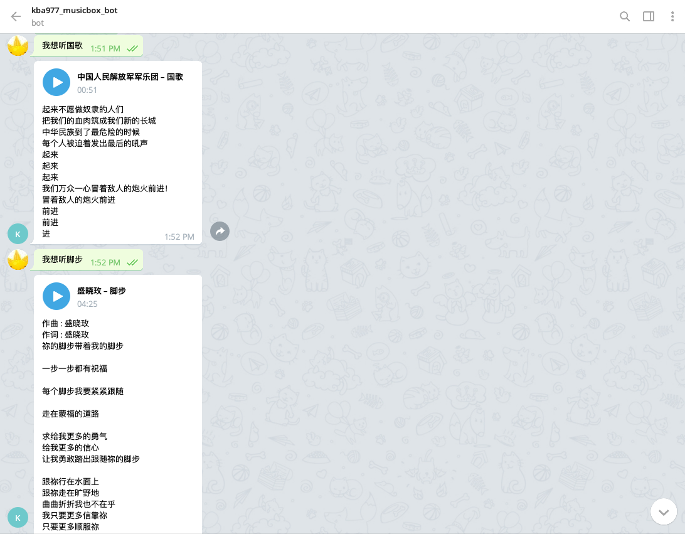
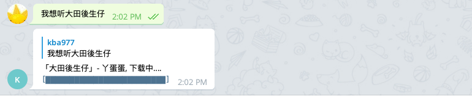
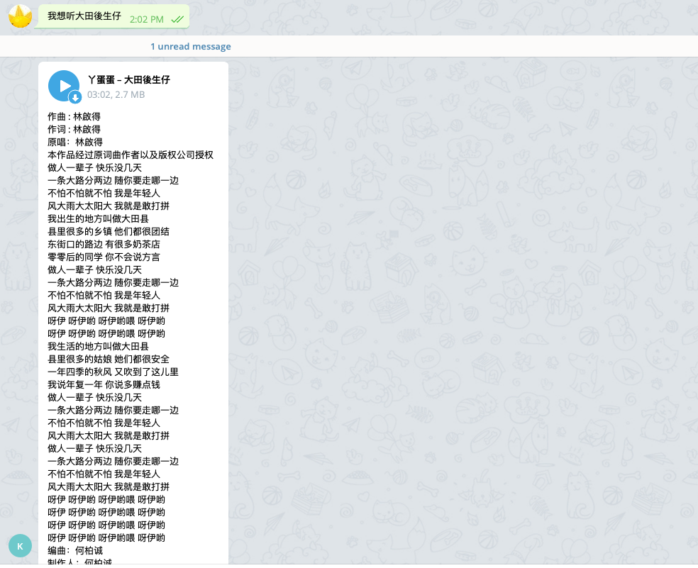
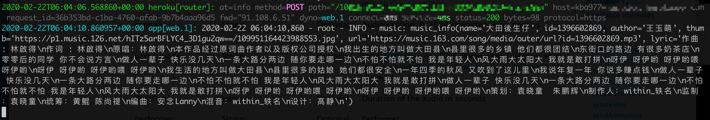
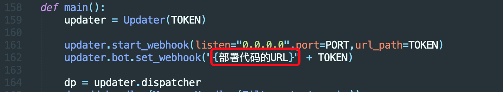
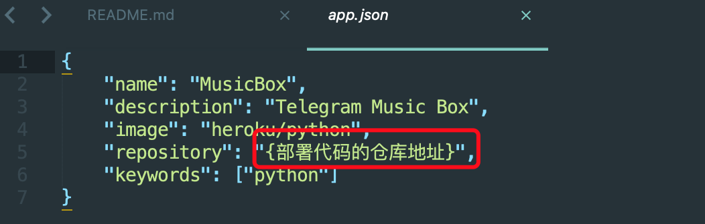

# Telegram 音乐盒子
在Telegram上搜索并下载某易云音乐

## 效果展示

在发出我想听XXX(歌曲名)后，bot返回的对话框状态由 搜索中 -> 下载中 -> 发送中 -> 歌曲 自动转换

### 搜索中
  

### 下载中
  

### 发送中
  

### 发送成功
  

### Heroku 日志

## 部署到Heroku

1. 第一步，根据[此项目](https://github.com/Binaryify/NeteaseCloudMusicApi)建立音乐API 并部署到 `heroku`；
2. 将代码中相应地方的变量替换掉，如 机器人 `Token`，上一步中音乐API的地址等；
3. 修改之后即可将本项目一同部署到 `heroku`，即可。

## 参考

1. 怎么部署网易云音乐API?  
   https://www.bilibili.com/video/av27407777

2. 那些地方需要替换掉？

   `TOKEN`: 这里替换成 bot 的 TOKEN
   
	
   
   即第一步中网易云音乐 API 的地址
   
   
   
    这里填写 heroku create 之后生成的 app 的地址。eg: `https://app-name.herokuapp.com/`
   
   
   
     这里填写 heroku create 之后生成的 app 的仓库地址 eg: `https://git.heroku.com/app-name.git`

3. 怎么将项目部署到 heroku？

   文档: https://devcenter.heroku.com/articles/getting-started-with-python

   

   
